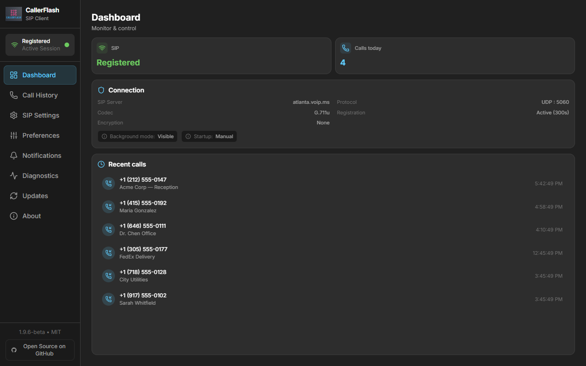
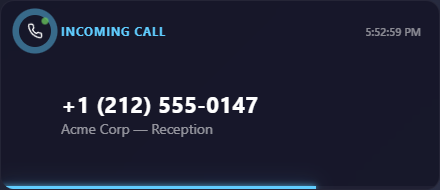
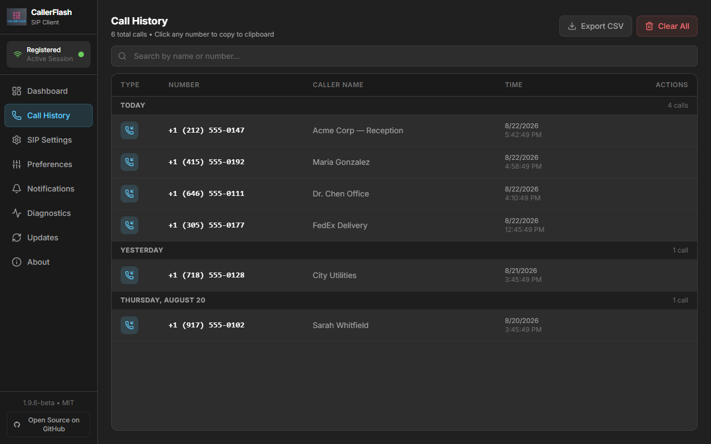
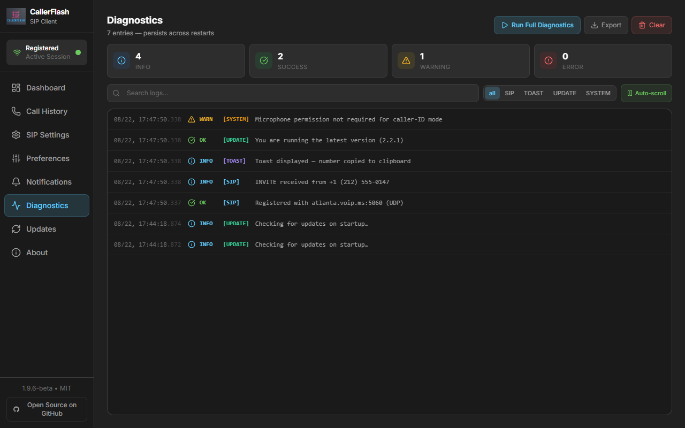

<div align="center">


# CallerFlash

**Know who's calling before you answer — right on your Windows desktop.**

A lightweight SIP caller-ID app that watches your phone line, flashes a toast
for every incoming call, and puts the caller's number on your clipboard so a
single **Ctrl+V** finds them in your CRM, browser, or ticketing system.

[](https://github.com/jaydenrussell/CallerFlash/releases)
[](https://github.com/jaydenrussell/CallerFlash/releases)
[](https://github.com/jaydenrussell/CallerFlash/releases)
[](https://github.com/jaydenrussell/CallerFlash/blob/main/LICENSE)
[](https://github.com/jaydenrussell/CallerFlash/releases)
[](https://github.com/jaydenrussell/CallerFlash/actions)

**[Download the latest installer](https://github.com/jaydenrussell/CallerFlash/releases/latest)** · [Report an issue](https://github.com/jaydenrussell/CallerFlash/issues) · [Security policy](SECURITY.md)

</div>

---

## Why CallerFlash?

If you take calls on a VoIP line (VoIP.ms, Twilio, Telnyx, and most SIP
providers), CallerFlash turns your desktop into a live caller-ID station:

1. **A call comes in** — a toast slides in from anywhere on screen with the
   number and caller name.
2. **The number is already copied** — just paste into your CRM to pull up
   their record before you even say hello.
3. **Nothing is missed** — every call lands in Call History, grouped by day,
   even if you were away from the desk.

No browser tab to keep open. No headset required — it only *watches* the
line for signaling, it never touches your audio.

| Dashboard | Incoming call toast |
|---|---|
|  |  |

## Highlights

- **Universal SIP** — UDP, TCP, or TLS. Tested with VoIP.ms; works with any
  RFC-compliant provider.
- **Auto clipboard copy** — the caller's number is on your clipboard before
  the first ring finishes.
- **Fully customizable toasts** — font, size, colors, position, duration,
  border radius, opacity. Draggable: put one where you want it and it stays.
- **Persistent call history** — grouped by Today / Yesterday / Last 7 days /
  Last 30 days / Older, searchable at a glance.

| Call history | Diagnostics |
|---|---|
|  |  |

- **Starts with Windows** — optionally launches minimized; calls are still
  detected in the background.
- **Auto-updates** — releases are signed (minisign) and verified before
  install; checksums and an SBOM ship with every release.
- **Security-first design** — credentials encrypted with Windows DPAPI,
  strict content-security policy, least-privilege Tauri permissions, and
  fuzz-tested SIP input handling.

## Install

1. Grab the latest `CallerFlash_<version>_x64-setup.exe` from the
   **[Releases page](https://github.com/jaydenrussell/CallerFlash/releases/latest)**.
2. Run the installer — no dependencies needed (WebView2 is installed
   automatically if missing).
3. Enter your SIP provider credentials in **SIP Settings**
   ([guide below](#sip-settings)).
4. Click **Connect** on the Dashboard — status turns green when registered.

That's it. When calls come in, the toast appears and the number is copied
automatically.

### SIP settings

| Field | Example | Notes |
|---|---|---|
| Server | `atlanta.voip.ms` | Pick a preset or enter your provider's host |
| Username | `100234` | Your SIP sub-account username |
| Password | •••••••• | Stored encrypted (DPAPI), never leaves your PC |
| Protocol | UDP / TCP / TLS | TLS recommended where supported |

## Development

Requires Windows, Node.js, and the Rust toolchain.

```bash
git clone https://github.com/jaydenrussell/CallerFlash.git
cd CallerFlash
npm install

npm run dev            # frontend dev server
npm run typecheck      # tsc
npm run lint           # eslint
npm test               # vitest + coverage floors
npm run build          # production frontend bundle
npm run tauri:build    # signed Windows installer
```

Rust-side checks live under `src-tauri/`: `cargo fmt`, `cargo clippy`,
`cargo test`, and `cargo llvm-cov --fail-under-lines 25`.

## License

MIT — see [LICENSE](LICENSE).
